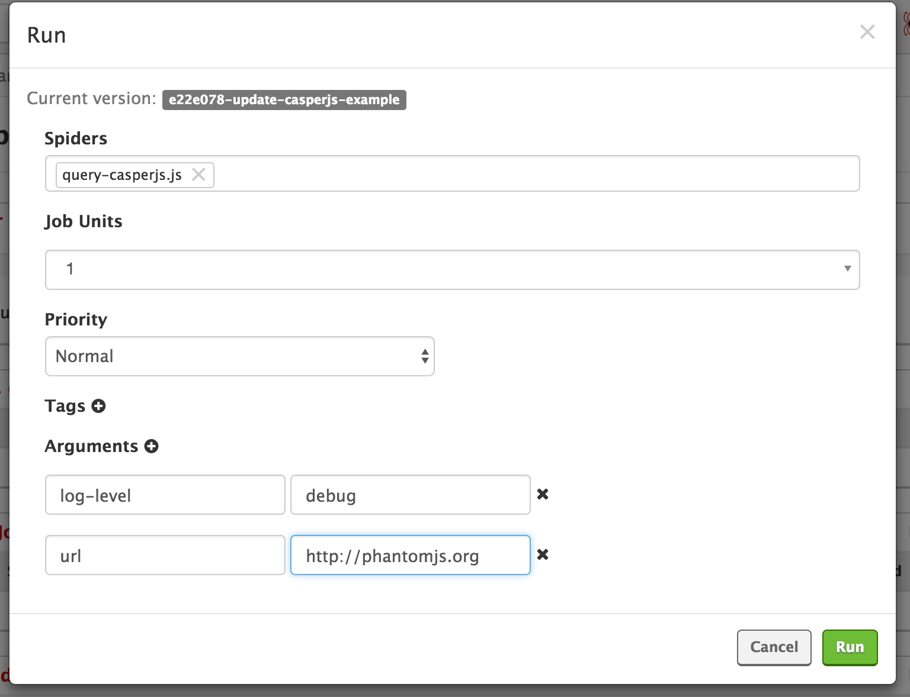

# CasperJS example

## Deploy to Scrapinghub

```
shub deploy
```


## Run the job




## Running CasperJS scripts locally

First, build the image:

```
docker build . -t casperjs-example
```

To run CasperJS scripts locally use `test-crawl` script. This script is not a part of
[Custom Images contract](http://shub.readthedocs.io/en/latest/custom-images-contract.html) and
exists only to help with testing CasperJS scripts locally.

- Run query-casperjs.js script:

  ```
  docker run -it --rm casperjs-example test-crawl query-casperjs.js
  ```

- Run query-casperjs.js script with start url http://phantomjs.org

  ```
  docker run -it --rm casperjs-example test-crawl query-casperjs.js --url=http://phantomjs.org
  ```

- Run query-casperjs-simple.js script with log level "debug":

  ```
  docker run -it --rm casperjs-example test-crawl query-casperjs-simple.js --log-level=debug
  ```

- Run query-casperjs-orig.js in verbose mode with log level "debug":

  ```
  docker run -it --rm casperjs-example test-crawl query-casperjs-orig.js --verbose --log-level=debug
  ```
